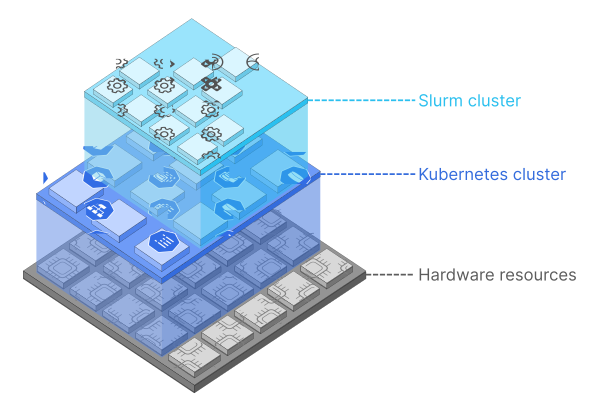

# Soperator – Kubernetes Operator for Slurm
[//]: # (Badges)

 

 

[//]: # (Short description)
Run Slurm in Kubernetes and enjoy the benefits of both systems.

## 📋 Table of contents
- [💡 Rationale](#-rationale)
- [⭐ Features](#-features)
- [❌ Limitations](#-limitations)
- [🚀 Installation](#-installation)
- [📈 Future plans](#-future-plans)
- [📚 Documentation](#-documentation)
- [🤬 Feedback](#-feedback)
- [🤝 Contribution](#-contribution)
- [🏛 License](#-license)

## 💡 Rationale
Both [Slurm](https://slurm.schedmd.com/overview.html) and [Kubernetes](https://kubernetes.io/docs/concepts/overview/)
can serve as workload managers for distributed model training and high-performance computing (HPC) in general.

Each of these systems has its strengths and weaknesses, and the trade-offs between them are significant. Slurm offers
advanced and effective scheduling, granular hardware control, and accounting, but lacks universality. On the other hand,
Kubernetes can be used for purposes other than training (e.g. inference) and provides good auto-scaling and self-healing
capabilities. For a detailed comparison, see the [Nebius AI blog post](https://nebius.ai/blog/posts/model-pre-training/slurm-vs-k8s).

It's unfortunate that there is no way to combine the benefits of both solutions. And since many big tech companies use
Kubernetes as their default infrastructure layer without supporting a dedicated model training system, some ML engineers
don't even have a choice.

That's why we decided to marry these systems, taking a "Kubernetes-first" approach. We implemented a [Kubernetes
operator](https://kubernetes.io/docs/concepts/extend-kubernetes/operator/), which is a software component that runs
and manages Slurm clusters as Kubernetes resources.

This allowed us to reuse the autoscaling and self-healing of Kubernetes in Slurm, and implement some unique features,
while maintaining the usual way of interacting with it.

[//]: # (TODO: Refer to the Soperator blog post)

## ⭐ Features

### Shared root filesystem
When users interact with a Slurm cluster, they see a shared filesystem as their root "**/**" directory. With this
approach, you can keep using Slurm in a familiar way (e.g. you don't need to run all jobs in containers).

It also means that you don't have to keep nodes in an identical state. Changes that you make on one node—e.g.
install new software packages, create Linux users, write job outputs, or download datasets—can be **immediately
reflected on all other nodes**.

### GPU health checks
If your Kubernetes cluster contains NVIDIA GPUs, the operator will perform regular GPU health checks. If a Slurm
node fails a health check, the operator “drains” it, so that new jobs are not scheduled on it.

### Easy scaling
Each stage of building an ML product has its own requirements for computing resources.

Soperator allows Slurm to reuse the unique Kubernetes feature of scaling automatically according to current needs.
You can simply change a single value in the YAML manifest and watch the cluster change in size.

### High availability
Kubernetes comes with some level of HA out of the box. If a pod or container, such as a Slurm controller, fails,
Kubernetes recreates it.

Soperator takes this even further, continuously bringing the entire cluster up to the desired state.

### Isolation of user actions
All user actions are isolated within a dedicated container-like environment, so that an action can’t break the
Slurm cluster itself by accident. This defines a clear boundary between operator and user responsibility.

## ❌ Limitations
- **GPUs are required**. Although support for CPU-only clusters or partitions seems pretty straightforward, we haven’t
  implemented it yet.
- **Unreliable scale-downs**. Clusters only scale up correctly. Scaling down leaves deleted nodes in the controller
  view; you can remove them manually using `scontrol`.
- **Single-partition clusters**. Slurm's ability to split clusters into several partitions isn't supported now.
- **Software versions**. The list of software versions we currently support is quite short.
 - Linux: Ubuntu [20.04](https://releases.ubuntu.com/focal/) and [22.04
   ](https://releases.ubuntu.com/jammy/).
 - Slurm: versions `23.11.6` and `24.05.3`.
 - CUDA: version [12.2.2](https://developer.nvidia.com/cuda-12-2-2-download-archive).
 - Kubernetes: >= [1.28](https://kubernetes.io/blog/2023/08/15/kubernetes-v1-28-release/).
 - Versions of some preinstalled software packages can't be changed.

## 🚀 Installation
The steps required to deploy Soperator to your Kubernetes cluster depend on whether you are using Kubernetes
on premises or in a cloud.

### Nebius AI
For [Nebius AI](https://nebius.ai/), we provide a Terraform recipe that creates everything itself, which includes:
- A [Managed Kubernetes](https://nebius.ai/docs/managed-kubernetes) cluster.
- A [virtual network](https://nebius.ai/docs/vpc) and public IP addresses.
- At least one shared [file storage](https://nebius.ai/docs/compute/concepts/filesystem) that stores your environment.
  File storages are distributed filesystems focused on concurrent reads and writes.

Everything specific to Nebius AI is contained in a separate repository:
[nebius/soperator-terraform](https://github.com/nebius/soperator-terraform).

[//]: # (TODO: Change repo in the link when it's moved to Nebius SA library)

### Other clouds and on-premises
> [!IMPORTANT]
> When using the soperator, it is important that the CNI supports preserving the client source IP.
> Therefore, if kube-proxy is configured in IPVS mode, or if you're using CNI plugins like kube-router or Antrea Proxy, the operator will not work.
> This operator has been tested with the [Cilium network plugin](https://kubernetes.io/docs/concepts/extend-kubernetes/compute-storage-net/network-plugins/)
> running in [kube-proxy replacement mode](https://docs.cilium.io/en/stable/network/kubernetes/kubeproxy-free/#kubernetes-without-kube-proxy).

In general, you need to follow these steps:
1. Decide on the shared storage technology you would like to use. At least one shared filesystem is necessary, because
   it will store the environment shared by Slurm nodes. The only thing the Soperator requires is the
   [PVC](https://kubernetes.io/docs/concepts/storage/persistent-volumes/) name. Consider using [NFS
   ](https://kubernetes.io/docs/concepts/storage/volumes/#nfs) as the simplest option, or something more advanced
   like [OpenEBS](https://openebs.io/) or [GlusterFS](https://www.gluster.org/).
2. Install the [NVIDIA GPU Operator](https://github.com/NVIDIA/gpu-operator).
3. If you use InfiniBand, install the [NVIDIA Network Operator](https://github.com/Mellanox/network-operator).
4. Install Soperator by applying the [slurm-operator](helm/slurm-operator) Helm chart.
5. Create a Slurm cluster by applying the [slurm-cluster](helm/slurm-cluster) Helm chart.
6. Wait until the `slurm.nebius.ai/SlurmCluster` resource becomes `Available`.

[//]: # (TODO: Refer to Helm OCI images instead of file directories when the repo is open)

> [!WARNING]
> Although Soperator should be compatible with any Kubernetes installation in principle, we haven't tested
> it anywhere outside Nebius AI, so it's likely that something won't work out of the box or will require additional
> configuration. If you're facing issues, create an issue in this repository, and we will help you install Soperator
> to your Kubernetes and update these docs.

## 📈 Future plans
- 🛠 **Slurm accounting**. We're working on bringing all the benefits of Slurm accounting to this solution.
- 🛠 **CPU-only clusters**. Some Slurm users don't need GPU computations, so we are working on supporting CPU-only
  clusters.
- 💡 **On-demand nodes**. The easy scaling can be improved further by provisioning new Kubernetes nodes only when
  there are queued jobs that need them.
- 💡 **Network topology-aware job scheduling**. Thanks to the Slurm topology feature, we can support detailed
  configuration of the network topology for more efficient scheduling.
- 💡 **Automatic replacement of bad-performing nodes**. Currently, Soperator just drains the Slurm nodes that have
  problems. We have a plan to replace such nodes automatically.
- 💡 **More system checks**. Soperator only checks GPUs at the moment, but there are more things to check: software
  issues, storage performance, network connectivity, etc. So we're going to continue adding new checks.
- 💡 **Jail backups**. This means backing up the shared storage to improve durability.
- 💡 **Automatic external checkpointing**. We consider using NVIDIA's [cuda-checkpoint
  ](https://github.com/NVIDIA/cuda-checkpoint) for dumping and resuming job processes externally.

## 📚 Documentation
The detailed documentation is located in the [docs](docs) directory of this repository.

It includes, among other things:
- A detailed description of the Soperator [architecture](docs/architecture.md).
- The [full list of features](docs/features.md) that this solution provides comparing to typical Slurm installations.
- A more complete description of the existing [limitations](docs/limitations.md).

## 🤬 Feedback
If you like this project, **star it on GitHub**. So we will see that the community is interested in it and continue
developing it further, openly and publicly.

If you failed to install Soperator to your Kubernetes cluster or encounter any other issue with it, create a [GitHub
issue](https://github.com/nebius/soperator/issues) and write details about your problem. We will try to help.

> [!NOTE]
> This project is very new and quite raw - it was started in May 2024. And if it already works stably in Nebius AI,
> this may not be the case for other clouds.

## 🤝 Contribution
Unfortunately, at the moment we don't have development docs for outside developers who want to participate in this
project. If you are interested in contribution, create a GitHub issue, and we'll figure something out.

Also, pay attention to the list of future plans we have. The tasks we are currently working on are marked there. Maybe
you need just one of these.

## 🏛 License
The Soperator itself is licensed under [Apache 2.0](LICENSE), a permissive free software license that allows you to use
the software for any purpose, to distribute it, to modify it, and to distribute modified versions under specific terms.

Please note that various pieces of software it installs in your cluster may have other licenses.
