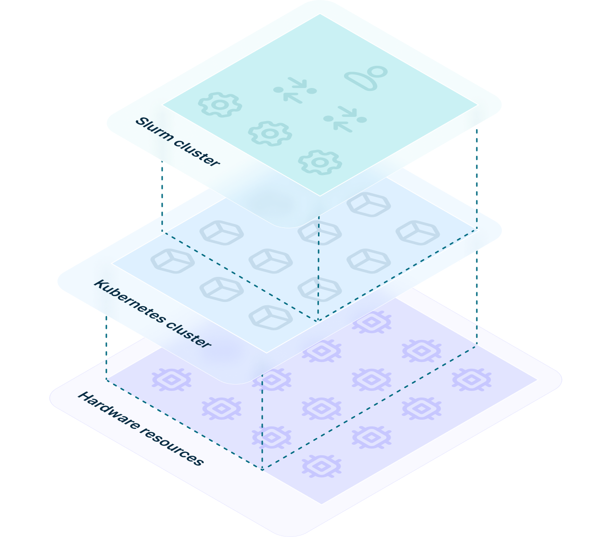

# Soperator

### Run Slurm on Kubernetes. Anywhere.

Soperator is an open-source Kubernetes operator for running Slurm clusters for AI training and high-performance computing (HPC).

**Simple cluster management · High reliability · Efficient GPU use**

 

[📚 Docs on GitHub](docs/) · [📚 Docs on Nebius](https://docs.nebius.com/slurm-soperator/) · [🗒️ Releases](https://github.com/nebius/soperator/releases) · [🐞 Issues](https://github.com/nebius/soperator/issues)

 

---

## 📋 Table of contents

- [What is Soperator](#-what-is-soperator)
- [Why Soperator](#-why-soperator)
- [Key features](#-key-features)
- [How it works](#-how-it-works)
- [Roadmap](#-roadmap)
- [Deployment options](#-deployment-options)
- [Requirements & supported versions](#-requirements--supported-versions)
- [Documentation](#-documentation)
- [Community & contributing](#-community--contributing)
- [License](#-license)

---

## ❓ What is Soperator

Slurm is a common scheduler for AI training and HPC workloads. Soperator is a Kubernetes operator that turns a `SlurmCluster` custom resource into a working Slurm cluster, including drivers, the CUDA/NCCL stack, shared storage, health checks, and accounting.

It is intended for platform teams and engineers who need to provide Slurm without managing each part of the cluster manually. It is also useful for teams moving from bare metal to Kubernetes-based Slurm.

## 🎯 Why Soperator

Running Slurm at scale is a challenge. Soperator focuses on solving three common problems.

| Problem | How Soperator solves it |
|---|---|
| **Slow setup and hard maintenance.** Deploying, resizing, upgrading, and reconfiguring Slurm clusters can take a lot of manual work. Keeping software consistent across nodes is also difficult. | A single `SlurmCluster` resource and a shared root filesystem (the *jail*) reduce manual setup and keep nodes in sync. |
| **Training jobs fail because of hardware issues.** A single bad GPU or node can interrupt long-running jobs. | Passive and active health checks detect GPU, network, storage, and system issues. Failed nodes can be drained and replaced automatically, and the control plane recovers after failures and restarts. |
| **GPUs sit idle.** Fixed-size clusters and poor placement reduce efficiency. | Ephemeral workers, InfiniBand-aware placement, and native Slurm scheduling help use GPU capacity more effectively. |

---

## ⭐ Key features

These features are available in the codebase today.

### Simple cluster management

- **Kubernetes operator.** Define controllers, login nodes, workers, accounting, and storage in a single `SlurmCluster` resource. The operator keeps the cluster aligned with that spec.
- **Portable deployment.** It can run on AWS, GCP, Azure, Nebius, OCI, bare metal, and air-gapped environments, as long as the Kubernetes cluster meets the requirements.
- **Jail (shared root filesystem).** Login and worker nodes share one root filesystem, so package and configuration changes appear across the cluster without per-node drift.
- **Preinstalled training stack.** Images include NVIDIA drivers, CUDA, NCCL, `nccl-tests`, and common training dependencies, with an explicit CUDA-to-NCCL version mapping.
- **Declarative maintenance.** Upgrades, resizing, `NodeSet` changes, and configuration updates are driven by `SlurmCluster` changes instead of manual node work.
- **Identity and accounting.** Supports SSSD for centralized users and groups (LDAP / AD / FreeIPA), Tailscale for SSH over a Tailnet, and Slurm accounting for job and user metrics.
- **Observability.** Integrates with Prometheus, Grafana, and Loki for metrics, dashboards, and logs.
- **Works with common Kubernetes tooling.** Supports Helm, Argo/Flux, cert-manager, Cilium, and NVIDIA GPU Operator.

### High reliability

- **Passive health checks.** Monitors Kubernetes and Slurm control-plane signals, along with node-local conditions such as NVMe disk health.
- **Active health checks.** `ActiveCheck` resources run scheduled GPU, system, storage, and network probes, including GPU performance checks.
- **Automatic draining, replacement, and recovery.** Failed nodes are drained and replaced automatically. Controllers, the accounting database, and login nodes return to the declared state after failures, restarts, and rolling updates.

### Efficient GPU use

- **Ephemeral nodes and autoscaling.** Workers are created on demand and scaled down when they are no longer needed.
- **InfiniBand topology awareness.** Supports correct InfiniBand topology for GPU nodes, tier-2 switch constraints, and exclusion of CPU-only nodes from the InfiniBand tree.
- **Container runtime support.** Pyxis / Enroot and OCI-compatible runtimes for jobs that still want image-based isolation.
- **Standard Slurm scheduling behavior.** Gang scheduling, fair-share, preemption, reservations, and dependencies work as expected.

---

## 💡 How it works

Soperator applies the standard Kubernetes operator pattern to Slurm.

1. **Declare a `SlurmCluster`.** One custom resource describes the cluster layout, including controllers, login nodes, worker `NodeSet`s, the accounting database, shared volumes, health checks, observability, and identity integration.
2. **The operator reconciles it.** Soperator turns that spec into Kubernetes objects such as Deployments, StatefulSets, PVCs, Services, ConfigMaps, and Slurm configuration, then keeps them in sync.
3. **The jail provides the root filesystem.** A shared PVC is mounted into each login and worker node as its root, so cluster-wide changes to binaries, libraries, and config files are visible immediately.
4. **Health checks keep watching the cluster.** Passive checks monitor control-plane and node signals, while `ActiveCheck` resources run scheduled probes. Failed nodes are drained and replaced automatically.
5. **Slurm behavior stays familiar.** `sbatch`, `srun`, `sinfo`, accounting, reservations, dependencies, and preemption work the way Slurm users expect.

📰 Deeper reading: [engineering deep-dive on Medium](https://medium.com/nebius) · [`docs/architecture.md`](docs/architecture.md)

---

## 📈 Roadmap

The items below are planned work. Follow our [release notes](https://github.com/nebius/soperator/releases) to see the latest changes.

- **Improved health checks.** Better active and passive checks for earlier detection and stronger resilience on long-running jobs.
- **Automatic acceptance tests.** Faster validation of new cluster configurations with less manual verification.
- **Next-generation GPU platforms.** Support for GB300-based systems.
- **Local disk support.** High-speed node-local storage for performance-sensitive training, faster checkpointing, and efficient data staging.
- **NCCL profiling dashboards.** Better visibility into collective communication bottlenecks.
- **Capacity sharing between training and inference.** Shift capacity as demand changes without running a separate cluster.
- **Multi-cluster, multi-cloud scheduling.** Coordinate workloads across multiple environments.

---

## 🚀 Deployment options

There are four deployment paths, all based on the same codebase.

| Path | Best for |
|---|---|
| **Self-deploy on any Kubernetes** | Teams running their own K8s, on any cloud or on-premises. [Learn more](https://docs.nebius.com/slurm-soperator/deploy/overview#self-deployment-on-other-platforms-and-on-premises). |
| **Managed Service for Soperator by Nebius** | Teams that want a managed cluster on Nebius. This service lets you get started with Soperator in just a few clicks using the Nebius web console. [Learn more](https://nebius.com/services/soperator). |
| **Soperator Pro on Nebius** | Teams that want Nebius engineers to install, tune, and support the cluster. [Learn more](https://docs.nebius.com/slurm-soperator/deploy/overview#pro-solution-for-soperator). |

---

## 🧪 Requirements & supported versions

| Component | Version |
|---|---|
| Linux (node images) | Ubuntu 24.04 |
| Slurm | 25.11.3 |
| CUDA | 12.8-13.0 |
| NCCL | ≥2.28  |
| Kubernetes | ≥ 1.32 |
| Helm | ≥ 3.14 |
| NVIDIA GPU Operator | latest stable |
| CNI | Cilium (kube-proxy replacement) recommended |

Some pre-installed software versions are pinned to the images Soperator ships. See [`docs/limitations.md`](docs/limitations.md) for current caveats, including the single-partition and GPU-only or CPU-only cluster constraints.

---

## 📚 Documentation

The [`docs/`](docs/) directory in this repository contains documentation for the
open-source, cloud-agnostic version of Soperator. It covers:

- Architecture details.
- Feature coverage compared with typical Slurm installations.
- Current limitations.
- Guidance for deploying Soperator on any cloud or on-premises.
- Local development with Kind.
- The release process for both the `soperator` and `nebius-solutions-library` repositories.
- Metrics collection and processing.
- Log collection and aggregation.

You can find documentation on Nebius services built on top of Soperator, including Managed Soperator at [docs.nebius.com/slurm-soperator](https://docs.nebius.com/slurm-soperator/).

---

## 🤝 Community & contributing

Soperator is an open-source project.

- ⭐ **Star** the repo if Soperator is useful to you.
- 🐞 **Report bugs and request features** in [Issues](https://github.com/nebius/soperator/issues).
- 💬 **Ask questions and share patterns** in [Discussions](https://github.com/nebius/soperator/discussions).
- 🔒 **Security** — report vulnerabilities per [`SECURITY.md`](SECURITY.md).
- 📰 **Blog** — [Introducing Soperator](https://nebius.com/blog/posts/soperator) · [Managed Soperator launch](https://nebius.com/blog/posts/managed-soperator) · [Soperator explained](https://nebius.com/blog/posts/soperator-explained).

---

## 🏛 License

Soperator is licensed under [Apache 2.0](LICENSE). Software it installs into your cluster may carry other licenses; please review for your use case.

---

**Built by [Nebius](https://nebius.com) and the Soperator community.**
_Run Slurm on Kubernetes. Anywhere._

