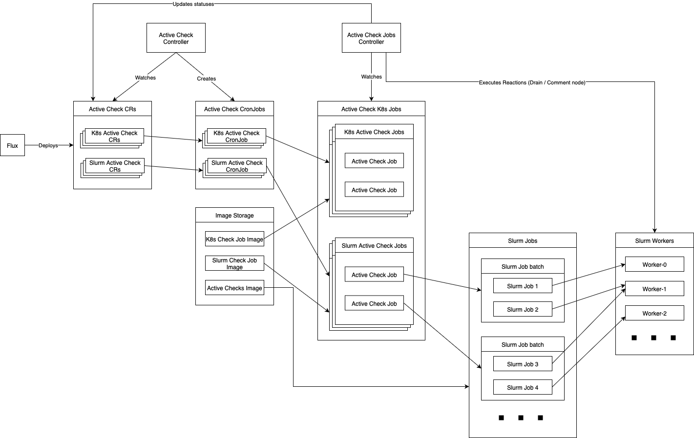

# Active Checks – Health and system checks framework

## Overview

Active Checks is a framework for running benchmarks and system tests across Kubernetes and Slurm environments.

The framework helps to:
- Verify node health and overall cluster stability.
- Validate and accept new hardware in data centers.
- Apply and confirm system changes (e.g., package updates).
- Run GPU/CPU, network/IB, filesystem, and other targeted checks.

Active Checks supports two execution modes:
- **Kubernetes Jobs** – checks running as scheduled or one-time jobs inside Kubernetes.
- **Slurm Jobs** – checks running on some or all Slurm nodes to validate compute hardware and environment.

Deployment follows a **GitOps model**: Flux deploys ActiveCheck CRs to clusters. Starting from a specific version of soperator, all clusters include Active Checks automatically through Helm charts managed by Flux.

## Architecture diagram

## Components

This section explains the main building blocks of the Active Checks framework, following the architecture diagram.

- **Flux**  
  GitOps tool that deploys the [soperator-activechecks Helm chart](https://github.com/nebius/soperator/tree/main/helm/soperator-activechecks).  
  Through this chart, Flux ensures that ActiveCheck CRs and controllers are consistently deployed across clusters.

- **Active Check CRs**  
  The core custom resource used to define a check.
    - A single CR with a `checkType` field that can be either `k8sJob` or `slurmJob`.
    - Defines parameters such as commands, schedules, resources, and slurm job submit options.  
      (See [ActiveCheck CRD](#activecheck-crd) for details.)

- **Active Check Controller**  
  Watches Active Check CRs and creates Kubernetes **CronJobs** for each of them (1:1 mapping).  
  For details of reconciliation logic, see [Controllers](#controllers).

- **Active Check Jobs (K8s or Slurm)**  
  Standard Kubernetes Job resources created by CronJobs.
    - K8s Active Check Jobs: run directly inside Kubernetes.
    - Slurm Active Check Jobs: submit one Slurm Job batch per Active Check Job.

- **Active Check Jobs Controller**  
  Watches Active Check Jobs (both K8s and Slurm-based).
    - Collects job results (for Slurm-based jobs via the [Slurm API client](https://github.com/nebius/soperator/blob/main/internal/slurmapi/client.go)).
    - Updates statuses of the parent Active Check CRs (see [Status fields](#status-fields)).
    - Executes reactions based on the outcome of the checks (see [Reactions fields (spec)](#reactions-fields-spec)).

- **Slurm Jobs**  
  Real Slurm jobs created by a Slurm Active Check K8s Job.
    - A batch may consist of one or many Slurm jobs.
    - Job output is written to `/mnt/jail/opt/soperator-outputs/slurm_jobs/`, which is also used by the observability stack.

- **Slurm Workers**  
  Compute nodes in the Slurm cluster where Slurm jobs execute.  
  These are the targets for most hardware acceptance and performance tests.

- **Image Storage**
  Stores container images that provide the environments needed for running checks.
    - **K8s Check Job Image** – environment for checks executed as Kubernetes Jobs.
    - **Slurm Check Job Image** – environment for submitting Slurm jobs.
    - **Active Checks Image** – image used inside Slurm jobs (typically via `srun`) for **most** checks (not all).

## ActiveCheck CRD

The **ActiveCheck** resource (`slurm.nebius.ai/v1alpha1`) defines one health check.  
The **[Active Check Controller](#1-active-check-controller)** ensures each `ActiveCheck` CR corresponds to exactly one **Kubernetes CronJob**.  
CronJobs create Kubernetes Jobs on schedule, which either run the check directly (K8s mode) or submit a Slurm batch (Slurm mode).

### Top-level `spec` fields

- **`spec.name`** *(string)* — Logical name used for generated CronJob/Jobs.
- **`spec.checkType`** *(enum: `k8sJob`|`slurmJob`)* — Selects execution mode.
- **`spec.schedule`** *(string)* — Cron schedule in standard Kubernetes Cron format.
- **`spec.suspend`** *(bool)* — If `true`, pauses scheduling without deleting resources.
- **`spec.activeDeadlineSeconds`** *(int64)* — Timeout for each *CronJob-run*.
- **`spec.successfulJobsHistoryLimit`** *(int32)* — How many successful Job objects to retain.
- **`spec.failedJobsHistoryLimit`** *(int32)* — How many failed Job objects to retain.
- **`spec.runAfterCreation`** *(bool)* — Run once immediately after the CronJob is created.
- **`spec.dependsOn`** *(string[])* — Names of other ActiveChecks (same namespace) that must complete before this one runs.  
  A check will not run until all its dependencies have reached **Complete** status.

#### Mode-specific options

**`spec.k8sJobSpec` (Kubernetes checks)**
- **`spec.k8sJobSpec.jobContainer.command`** *(string[])* — Entrypoint/command for the check container.
- **`spec.k8sJobSpec.scriptRefName`** *(string)* — Name of a `ConfigMap` containing a custom script at key `script.sh`.

**`spec.slurmJobSpec` (Slurm checks)**
- **`spec.slurmJobSpec.sbatchScriptRefName`** *(string)* — Name of a `ConfigMap` containing an sbatch script at key `sbatch.sh`.
- **`spec.slurmJobSpec.sbatchScript`** *(string, multiline)* — Inline sbatch script. May contain `#SBATCH` directives and shell logic; can invoke `srun`.
- **`spec.slurmJobSpec.eachWorkerJobArray`** *(bool)* — Run on **each worker** once using a **Slurm job array**.
- **`spec.slurmJobSpec.eachWorkerJobs`** *(bool)* — Run on **each worker** using **separate Slurm jobs**.
- **`spec.slurmJobSpec.maxNumberOfJobs`** *(int64)* — Maximum number of simultaneous jobs. If less than the number of workers, only a subset runs. `0` = no limit.

### Reactions fields (spec)

- **`spec.reactions`** *(deprecated)* — Legacy reactions block.
- **`spec.successReactions`** *(Reactions)* — Actions to take when a Slurm run **succeeds**.
- **`spec.failureReactions`** *(Reactions)* — Actions to take when a Slurm run **fails**.

`Reactions` supports:
- **`drainSlurmNode`** — Drain affected Slurm nodes.
- **`commentSlurmNode`** — Add a failure comment to affected nodes.
- **`addReservation`** — Create a Slurm reservation with name `<prefix>-<nodeName>`.
- **`removeReservation`** — Remove a reservation with name `<prefix>-<nodeName>`.

Reactions are evaluated by the **Active Check Jobs Controller** after Slurm runs.  
Affected nodes are derived from the Slurm job’s node list (`GetNodeList()`).

### `status` fields

#### `status.k8sJobsStatus`
- **`lastTransitionTime`** *(time)* — Last status change.
- **`lastJobScheduleTime`** *(time)* — Last CronJob schedule event.
- **`lastJobSuccessfulTime`** *(time)* — Time of last successful Job.
- **`lastJobName`** *(string)* — Name of the last Job.
- **`lastJobStatus`** *(enum)* — One of:
    - `Active` — Job currently running.
    - `Complete` — Job finished successfully.
    - `Failed` — Job failed (reactions do **not** apply for K8s jobs).
    - `Suspended` — Job was suspended.
    - `Pending` — Job created but not yet started.
    - `Unknown` — State could not be determined.

#### `status.slurmJobsStatus`
- **`lastTransitionTime`** *(time)* — Last status change.
- **`lastRunId`** *(string)* — Identifier of the last Slurm batch run.
- **`lastRunName`** *(string)* — Name of the last Slurm run.
- **`lastRunStatus`** *(enum)* — One of:
    - `InProgress` — Run is still ongoing.
    - `Complete` — Run finished successfully (**success reactions may apply**).
    - `Failed` — Check failed (**failure reactions may apply**).
    - `Error` — Error in job submission or check implementation.
- **`lastRunFailJobsAndReasons`** *(array)* — List of `{ jobID, reason }` for failed jobs in the last run.
- **`lastRunErrorJobsAndReasons`** *(array)* — List of `{ jobID, reason }` for error jobs in the last run.
- **`lastRunSubmitTime`** *(time)* — Submission time of the last run.

## Execution Modes

Execution depends on `spec.checkType`.  
In both cases, the Active Check Controller creates a CronJob (1:1 with CR) which then spawns Jobs.

### Shared concepts
- **Kubernetes CronJob** → schedules the runs.
- **Kubernetes Job** → executes a single run.
- **Images**:
    - *K8s Check Job Image* → used in `k8sJob`.
    - *Slurm Check Job Image* → used in `slurmJob` for submitting.
    - *Active Checks Image* → used inside the actual Slurm workload for **most** checks (not all).

### Kubernetes Jobs (`k8sJob`)
- The CronJob spawns a Kubernetes Job that runs the check inside the cluster.
- Logs are available directly in the Job’s Pod.
- No reactions are applied; only status is updated.

### Slurm Jobs (`slurmJob`)
- The CronJob spawns a Kubernetes Job that **submits a Slurm batch job**.
- Batch may contain one or many Slurm jobs.
- Logs are written under `/mnt/jail/opt/soperator-outputs/slurm_jobs/`.
- After the run completes, the Jobs Controller may apply success/failure reactions (see [Reactions fields (spec)](#reactions-fields-spec)); affected nodes come from Slurm’s `GetNodeList()`.

#### Slurm job submission modes
- **Default** — One Slurm batch per run.
- **eachWorkerJobArray** — Run once per worker using a Slurm job array.
- **eachWorkerJobs** — Run once per worker using separate Slurm jobs.
- **maxNumberOfJobs** — Limits concurrent jobs; if less than the number of workers, only a subset executes.

#### Slurm partitions (defaults)
There are three partitions by default:
- **main** — used for clients’ jobs.
- **hidden** — hidden partition with the same priority as `main`.
- **background** — hidden partition with lower priority than `main` and `hidden`.

Submission modes use partitions as follows:
- **Default** (single job) → `hidden` partition.
- **eachWorkerJobs** (separate job per worker) → `hidden` partition.
- **eachWorkerJobArray** (job array per worker) → `background` partition.

Using `background` for job arrays avoids nodes stuck in **PLANNED** and prevents the `main` partition queue from being blocked by large arrays.

## Observability

The Active Checks framework integrates with the cluster observability stack.

### Logging
- **K8s jobs** → logs are available from the Pods of the Kubernetes Jobs.
- **Slurm jobs** → logs are written under `/mnt/jail/opt/soperator-outputs/slurm_jobs/`.
- Other logs (e.g., passive checks) also exist under the broader `/soperator-outputs/` path, but are out of scope for this doc.

### Dashboards
Results and metrics are visualized in [Grafana](https://grafana.nebius.dev/d/aevt1f8eixhc0f/gpu-health-checker3a-runs). Operators can quickly see:
- Recent check runs and their outcomes.
- Historical success/failure rates.
- Node-level health across multiple checks.

## Controllers

Active Checks are managed by two controllers. Together they implement a GitOps-friendly flow:
**ActiveCheck CR → CronJob (1:1) → Jobs → Status & (if Slurm) Reactions**.

### 1. Active Check Controller

**Purpose**
- Watches `ActiveCheck` CRs and reconciles each CR **into exactly one Kubernetes CronJob**.
- Encodes CronJob settings from the CR (`schedule`, `suspend`, `activeDeadlineSeconds`, history limits, `runAfterCreation`).
- Ensures optional script sources are wired (e.g., inline `slurmJobSpec.sbatchScript` via ConfigMap).
- Adds/removes the `slurm.nebius.ai/activecheck-finalizer` to support safe teardown.

**High-level flow**
1. On create/update:
    - Validate dependencies (`dependsOn`) and check Slurm cluster readiness.
    - Render and reconcile the CronJob (and ConfigMap if needed).
    - Optionally trigger an immediate run if `runAfterCreation` is set and no prior transition exists.
2. On delete:
    - Clean up the CronJob and inline-script ConfigMap (if any).
    - Remove the finalizer.

### 2. Active Check Jobs Controller

**Purpose**
- Observes **Jobs** created by CronJobs (both k8s and slurm modes).
- Aggregates results and **updates `ActiveCheck.status`** (see [Status fields](#status-fields)).
- Applies **reactions** for Slurm runs according to `successReactions` / `failureReactions` (see [Reactions fields (spec)](#reactions-fields-spec)).

**High-level flow**
1. Map each Kubernetes Job back to its owning `ActiveCheck`.
2. **Kubernetes mode**
    - Compute `lastJobStatus` (`Active`, `Complete`, `Failed`, `Suspended`, `Pending`, `Unknown`) and update `k8sJobsStatus`.
    - No reactions applied.
3. **Slurm mode**
    - Parse Slurm job IDs from Kubernetes Job annotations.
    - Query the [Slurm API client](https://github.com/nebius/soperator/blob/main/internal/slurmapi/client.go) for job states.
    - Aggregate results into `slurmJobsStatus` (run ID/name/status, failed/error jobs with reasons, submit time).
    - If terminal:
        - On **Failed** → apply **failureReactions** (e.g., drain/comment, add reservation).
        - On **Complete** → apply **successReactions** (e.g., remove reservation).
    - Requeue while jobs are in progress.
4. Patch Job annotations with a “final state” timestamp to avoid reprocessing.

**Error handling & GC (high level)**
- Requeues on transient errors (API reads/patches).
- Job history is pruned by CronJob’s `successfulJobsHistoryLimit` / `failedJobsHistoryLimit`.

## Roadmap & Limitations

### Current limitations
- **No retries for active checks**: if a run fails immediately on creation, dependent checks won’t proceed until manual intervention.
- **Job history pruning**: limited to CronJob’s `successfulJobsHistoryLimit` and `failedJobsHistoryLimit`; no long-term archival.

### Planned improvements
- **Multi-node Slurm checks**: running checks across multiple nodes per job is not yet supported.
