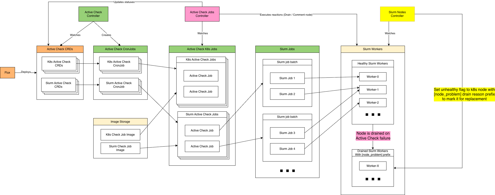

# Active Checks - health and system checks framework

This document describes the current Active Checks framework in soperator.

## Overview

Active Checks run cluster checks from Kubernetes while optionally submitting work into Slurm. The framework is built around the `ActiveCheck` custom resource (`slurm.nebius.ai/v1alpha1`) and supports two check types:

- `k8sJob` - a Kubernetes Job runs the check logic directly.
- `slurmJob` - a Kubernetes Job prepares the jail/Slurm environment and submits one or more Slurm jobs.

Active Checks are used for:

- GPU health checks on Slurm workers.
- Bootstrap and readiness checks, such as creating users, preparing the jail, waiting for topology, and verifying that `srun` works.
- Scheduled maintenance tasks, such as dry-run jail state management and NCCL profile cleanup.
- Custom operator or customer checks applied as additional `ActiveCheck` CRs.

There is no separate "extensive check" resource or execution path in the current framework.

Deployment is GitOps-oriented. The `helm-soperator-activechecks` chart renders `ActiveCheck` CRs, packaged scripts, and a Helm hook job that waits for initial checks. In `helm/soperator-fluxcd`, `soperatorActiveChecks.enabled` is `true` by default, and Flux deploys the chart after the Slurm cluster and `soperatorchecks` controller release.

Slurm cluster users can also apply custom `ActiveCheck` CRs directly, outside the Flux-managed chart.

## Architecture diagram

## Components

- **Flux / Helm**
  Flux deploys the `helm-soperator-activechecks` chart through a HelmRelease. The chart renders default checks from `helm/soperator-activechecks/values.yaml` and can be customized with values from optional ConfigMaps.

- **ActiveCheck CRs**
  `ActiveCheck` resources define the desired check type, schedule, pod placement, job container, optional Slurm submission script, dependencies, and reactions.

- **ServiceAccount Controller**
  Watches `ActiveCheck` creation and reconciles a ServiceAccount, Role, and RoleBinding for the target Slurm cluster. Active Check pods use this ServiceAccount.

- **Active Check Controller**
  Watches `ActiveCheck` CRs and reconciles each CR into a Kubernetes CronJob. It also creates an inline sbatch ConfigMap when `spec.slurmJobSpec.sbatchScript` is used.

- **Active Check CronJobs and Kubernetes Jobs**
  Every `ActiveCheck` is executed by Kubernetes Jobs created from a CronJob. If `runAfterCreation` is enabled, the controller also creates one immediate Job named from `spec.name`.

- **Kubernetes check jobs (`k8sJob`)**
  These jobs run command/script logic directly in the Kubernetes pod. They can optionally include a Munge init container and Slurm config mounts when the check needs Slurm authentication.

- **Slurm submission jobs (`slurmJob`)**
  These Kubernetes Jobs run the `slurm_check_job` image. The entrypoint prepares the jail view, mounts the sbatch script, submits Slurm jobs to the `hidden` partition, and annotates the Kubernetes Job with the Slurm job IDs.

- **Slurm jobs**
  The actual Slurm workloads. In regular mode there is one sbatch submission per Active Check run. In `eachWorkerJobs` mode the submitter creates separate one-node Slurm jobs for selected worker nodes.

- **Active Check Jobs Controller**
  Watches Active Check Kubernetes Jobs, maps them back to their owning `ActiveCheck`, updates CR status, polls Slurm accounting for Slurm job results, and executes Slurm node reactions.

- **Active Check Prolog Controller**
  Watches Slurm clusters and publishes `activecheck-prolog.sh` into the jail through a ConfigMap and `JailedConfig`. The script removes the active check name from the current Slurm node's `Extra` JSON field under a node-local lock.

- **Slurm Nodes and K8s Nodes Controllers**
  These are part of the broader `soperatorchecks` controller manager. They process Slurm drain reasons such as `[node_problem]` and `[hardware_problem]`, set Kubernetes node conditions such as `HardwareIssuesSuspected`, and coordinate drain/reboot/replacement flows when node replacement is enabled.

- **Images and packaged scripts**
  The active checks chart uses `k8sJob`, `slurmJob`, `munge`, and `sansible` images. Packaged scripts live in `helm/soperator-activechecks/scripts/`.

## ActiveCheck CRD

The `ActiveCheck` resource defines one check. In generated chart resources, `metadata.name` and `spec.name` are kept the same. Custom CRs should do the same because different implementation paths use both names: the CronJob uses `metadata.name`, the initial run Job uses `spec.name`, the inline sbatch ConfigMap uses `spec.name`, and Slurm submission uses the ActiveCheck metadata name as `ACTIVE_CHECK_NAME`.

### Top-level `spec` fields

- `spec.name` *(string, required)* - Logical check name used for generated resources such as the initial run Job and inline sbatch ConfigMap.
- `spec.slurmClusterRefName` *(string, required)* - Target `SlurmCluster` name in the same namespace.
- `spec.checkType` *(enum: `k8sJob` or `slurmJob`, default `k8sJob`)* - Selects the execution mode.
- `spec.schedule` *(string, default `0 0 1 1 *`)* - Kubernetes CronJob schedule.
- `spec.suspend` *(bool pointer, API default `true`)* - Passed to the CronJob. The Helm chart renders `false` when a chart check omits this value, so chart defaults are check-specific rather than pure CRD defaults.
- `spec.activeDeadlineSeconds` *(int64, default `1800`)* - Rendered as `pod.spec.activeDeadlineSeconds` for each check pod.
- `spec.successfulJobsHistoryLimit` *(int32, default `3`)* - Successful Kubernetes Jobs retained by the CronJob.
- `spec.failedJobsHistoryLimit` *(int32, default `16`)* - Failed Kubernetes Jobs retained by the CronJob.
- `spec.runAfterCreation` *(bool pointer, API default `true`)* - Creates one immediate Job after the CronJob exists and before any status transition has been recorded. The Helm chart renders `false` when a chart check omits this value.
- `spec.dependsOn` *(string array)* - Names of prerequisite ActiveChecks in the same namespace. A dependent check waits until each prerequisite with `runAfterCreation: true` has completed. `k8sJob` prerequisites require `Complete`; `slurmJob` prerequisites require `Complete` or `Skipped`.
- `spec.nodeSelector`, `spec.affinity`, `spec.tolerations` - Passed through to the check pod template.
- `spec.podTemplateNameRef` *(string pointer)* - Optional `PodTemplate` whose template is merged into the generated pod template.
- `spec.hostUsers` *(bool pointer)* - Passed to `pod.spec.hostUsers` when rendered. The Helm chart auto-detects this value from Kubernetes version unless `.Values.hostUsers` is explicitly set.
- `spec.successReactions` / `spec.failureReactions` - Slurm node reactions executed for terminal Slurm jobs.

The generated CronJob uses `ForbidConcurrent`, `parallelism: 1`, `completions: 1`, `restartPolicy: Never`, and `backoffLimit: 0`.

### `spec.k8sJobSpec`

- `jobContainer` *(ContainerSpec)* - Image, command, args, working directory, environment, volumes, mounts, pull policy, pull secrets, and AppArmor profile for the main check container.
- `mungeContainer` *(ContainerSpec pointer)* - Optional Munge init container. When present, the pod also receives Slurm config, Munge key/socket volumes, and related mounts.
- `scriptRefName` *(string pointer)* - Optional ConfigMap name. The ConfigMap must contain `script.sh`; it is mounted as `/opt/bin/entrypoint.sh`, and the container command becomes `/bin/bash /opt/bin/entrypoint.sh`.

The activechecks Helm chart usually renders packaged K8s scripts directly as the container command instead of using `scriptRefName`.

### `spec.slurmJobSpec`

- `jobContainer` *(ContainerSpec)* - Main Kubernetes container that submits Slurm work. Chart defaults use the `slurmJob` image and common jail PVC mount.
- `mungeContainer` *(ContainerSpec)* - Munge init container for Slurm authentication.
- `sbatchScriptRefName` *(string pointer)* - Optional ConfigMap name containing key `sbatch.sh`.
- `sbatchScript` *(string pointer)* - Inline sbatch script. The Active Check Controller writes it to a ConfigMap named `sbatch-script-<spec.name>` under key `sbatch.sh`.
- `eachWorkerJobs` *(bool, default `false`)* - Submit one separate one-node Slurm job per selected worker.
- `maxNumberOfJobs` *(int64 pointer, default `0`)* - Limit for `eachWorkerJobs`. `0` or unset means no limit; a positive value randomly selects up to that many candidate nodes.

Slurm submission details:

- Jobs are submitted to the `hidden` partition.
- Jobs run as user `soperatorchecks` with working directory `/opt/soperator-home/soperatorchecks`.
- Output and error are written to `/opt/soperator-outputs/local/slurm_jobs/%N.%x.%j.out`.
- `eachWorkerJobs` cancels active jobs with the same name in the `hidden` partition before submitting new per-node jobs.
- Candidate nodes exclude Slurm states such as `DOWN`, `DRAIN`, `ERROR`, `RESERVED`, `NOT_RESPONDING`, and reboot/power-down states.
- If the sbatch script contains GPU directives (`--gpus-per-node`, `--gpus`, `--gres=gpu`, or `-G`), the submitter treats the check as GPU-required. It skips the whole check when `slurm_base.conf.noedit` exists and declares no GPU nodes, and in `eachWorkerJobs` mode it submits only to GPU-capable nodes.

## Reactions

Reactions are evaluated only for `slurmJob` checks, per terminal Slurm job observed in accounting:

- `spec.failureReactions` is executed for failed Slurm jobs.
- `spec.successReactions` is executed for completed Slurm jobs.
- Cancelled and unhandled terminal states update status but do not execute reactions.

Supported reaction fields:

- `drainSlurmNode.drainReasonPrefix` - Drains each node from the Slurm job node list. The reason is `<prefix> <activeCheckName>: job <jobID> [slurm_job]`.
- `commentSlurmNode.commentPrefix` - Updates each node from the Slurm job node list with comment `<prefix> <activeCheckName>: job <jobID> [slurm_job]`.

The API can represent both drain and comment reactions. The activechecks Helm chart rejects a single check that sets both `failureReactions.commentSlurmNode.commentPrefix` and `failureReactions.drainSlurmNode.drainReasonPrefix`.

## Status

### `status.k8sJobsStatus`

- `lastTransitionTime` - Last time the stored K8s job status changed.
- `lastJobScheduleTime` - CronJob last schedule time.
- `lastJobSuccessfulTime` - CronJob last successful time.
- `lastJobName` - Last Kubernetes Job name.
- `lastJobStatus` - One of:
  - `Active` - Job has active pods.
  - `Complete` - Job has `Complete` or `SuccessCriteriaMet`.
  - `Failed` - Job has `Failed` or `FailureTarget`.
  - `Suspended` - Job has `Suspended`.
  - `Pending` - Job has no active pods and no conditions.
  - `Unknown` - State could not be classified.

### `status.slurmJobsStatus`

- `lastTransitionTime` - Last time the stored Slurm run status changed.
- `lastRunId` - First Slurm job ID in the run, or `No slurm job` for skipped/submission-error paths.
- `lastRunName` - Slurm job name from accounting, or the Kubernetes Job name when no Slurm job was submitted.
- `lastRunStatus` - One of:
  - `InProgress` - At least one Slurm job is still running, missing from accounting, or has no end time yet.
  - `Complete` - All observed Slurm jobs completed successfully.
  - `Failed` - At least one Slurm job failed after all jobs reached terminal accounting state.
  - `Error` - Slurm submission failed before job IDs were available, or accounting returned an unhandled terminal state.
  - `Cancelled` - At least one Slurm job was cancelled and there were no failed or error jobs.
  - `Skipped` - The submitter intentionally did not call `sbatch`, currently used when a GPU-required check sees a Slurm base config with no GPU nodes.
- `lastRunFailJobsAndReasons` - Failed Slurm jobs and reasons.
- `lastRunErrorJobsAndReasons` - Jobs in unhandled terminal states and reasons.
- `lastRunCancelledJobs` - Cancelled Slurm job IDs.
- `lastRunSubmitTime` - Slurm submit time from accounting when available.

While any Slurm job still needs polling, the aggregate status remains `InProgress`. Once all jobs are terminal, status precedence is `Failed`, then `Error`, then `Cancelled`, then `Complete`.

## Execution modes

### Shared flow

1. The ServiceAccount Controller creates RBAC for the target Slurm cluster.
2. The Active Check Controller waits until the `SlurmCluster` exists, is `Available`, and is not in maintenance.
3. The controller checks `dependsOn` prerequisites.
4. The controller reconciles a CronJob and, for inline Slurm scripts, an sbatch ConfigMap.
5. The CronJob creates Kubernetes Jobs on schedule. If `runAfterCreation` is true and no status transition exists yet, the controller creates `<spec.name>-initial-run`.
6. The Active Check Jobs Controller watches Jobs with the soperatorchecks component label and updates the owning `ActiveCheck` status.

### Kubernetes jobs (`k8sJob`)

The Kubernetes Job runs the configured container command directly. Logs are available from the Job pod. No Slurm reactions are executed for `k8sJob` checks.

### Slurm jobs (`slurmJob`)

The Kubernetes Job submits Slurm work and annotates itself with:

- `slurm-job-id` - comma-separated Slurm job IDs for the run.
- `unhandled-slurm-job-id` - IDs that still need to be observed in terminal accounting state.

If a GPU-required check is skipped before submission, the Job is annotated with `slurm-skipped-reason` and the ActiveCheck status becomes `Skipped` after the Kubernetes Job reaches a terminal state.

The Active Check Jobs Controller queries Slurm accounting through the Slurm API client. It requeues while jobs are not visible in accounting, are not terminal, or have no end time. It records a `soperator-checks-final-state-time` annotation on the Kubernetes Job to avoid reprocessing already handled terminal Slurm jobs.

## Packaged chart checks

The default `helm-soperator-activechecks` values currently define these checks:

- `gpu-checks` - enabled `slurmJob`, runs twice daily and after creation, uses `eachWorkerJobs` with `maxNumberOfJobs: 200`, and drains failed nodes with `[node_problem]`.
- `ensure-healthy-nodes` - enabled `slurmJob`, suspended except initial run, verifies that Slurm nodes have no reason and are not in bad states.
- `dcgmi-diag-r3` - disabled `slurmJob` template for DCGM diagnostics.
- `create-user-soperatorchecks` and `create-user-nebius` - enabled `k8sJob` bootstrap checks.
- `manage-jail-state` - enabled `k8sJob` initial Ansible run for jail state.
- `manage-jail-state-force` - enabled but not run after creation by default; forces reinstall/upgrade paths when triggered.
- `manage-jail-state-dry-run` - enabled scheduled Ansible dry run.
- `wait-for-topology` and `wait-for-soperatorchecks-srun-ready` - enabled readiness checks used as dependencies.
- `nccl-profiles-cleaner` - enabled scheduled cleanup of shared NCCL profile dumps.
- `retrigger-checks` - enabled helper check for retriggering ActiveChecks.

The chart also creates a Helm hook Job named `<slurmClusterRefName>-wait-for-active-checks`. It waits for `runAfterCreation: true` checks for the target cluster, excluding checks that define `failureReactions.commentSlurmNode`. It treats K8s `Complete` as success, Slurm `Complete`, `Skipped`, and `Cancelled` as terminal success for the Helm release, and fails the release on K8s `Failed` or Slurm `Failed`.

## Node health and replacement

Active Check failure reactions can drain Slurm nodes with reason prefixes such as `[node_problem]` or `[hardware_problem]`. The Slurm Nodes Controller periodically lists drained Slurm nodes and processes well-known reasons:

- `[node_problem]` - Parsed as a health check failure. If node replacement is enabled, the controller sets `HardwareIssuesSuspected=True` on the corresponding Kubernetes node after confirming the Slurm nodes on that Kubernetes node are fully drained.
- `[hardware_problem]` - Also sets `HardwareIssuesSuspected=True` when node replacement is enabled.
- `Kill task failed`, node reboot, and maintenance replacement reasons are handled by the same controller family but are not ActiveCheck-specific.

Before marking a Kubernetes node unhealthy, the controller avoids acting on stale Slurm drain reasons from a previous worker assignment. If the current worker pod was assigned after the drain reason changed, it undrains the Slurm node instead.

## Observability

- K8s check logs are available from the Kubernetes Job pods.
- Slurm check stdout/stderr is written under `/opt/soperator-outputs/local/slurm_jobs/`. This is node-local storage in the jail, backed by the worker boot disk.
- The jail logs OpenTelemetry collector ships `slurm_jobs` logs and extracts labels such as `slurm_node_name`, `job_name`, `job_id`, and `job_array_id` from filenames.
- Current check result state is available in `ActiveCheck` status and in the Kubernetes Job annotations used by the controller.
- These controllers do not expose a separate ActiveCheck-specific metrics surface in this repository. Use CR status, Kubernetes Job/Pod state, Slurm accounting, and centralized logs for troubleshooting.

## Limitations

- Active Check Kubernetes Jobs use `backoffLimit: 0`; failed runs are not retried by the Job controller.
- Dependency handling is based on the latest stored status. Dependencies only gate checks whose prerequisite CRs have `runAfterCreation: true`; prerequisites without that flag are skipped by dependency evaluation.
- Slurm result aggregation depends on Slurm accounting. A submitted job that is not yet visible in accounting keeps the ActiveCheck status `InProgress` and causes the controller to requeue.
- Job object retention is limited to the CronJob history limits. Long-term Slurm output retention depends on the centralized logging pipeline, not on ActiveCheck CR status.
