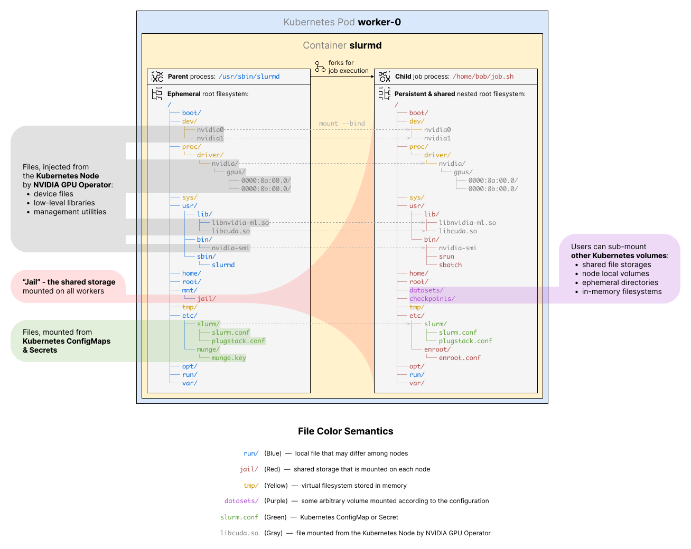
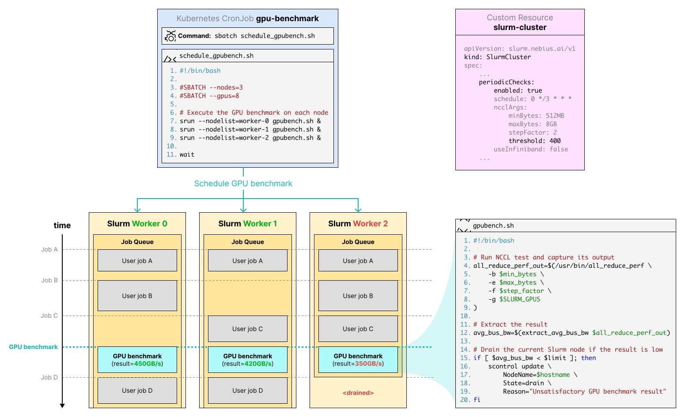
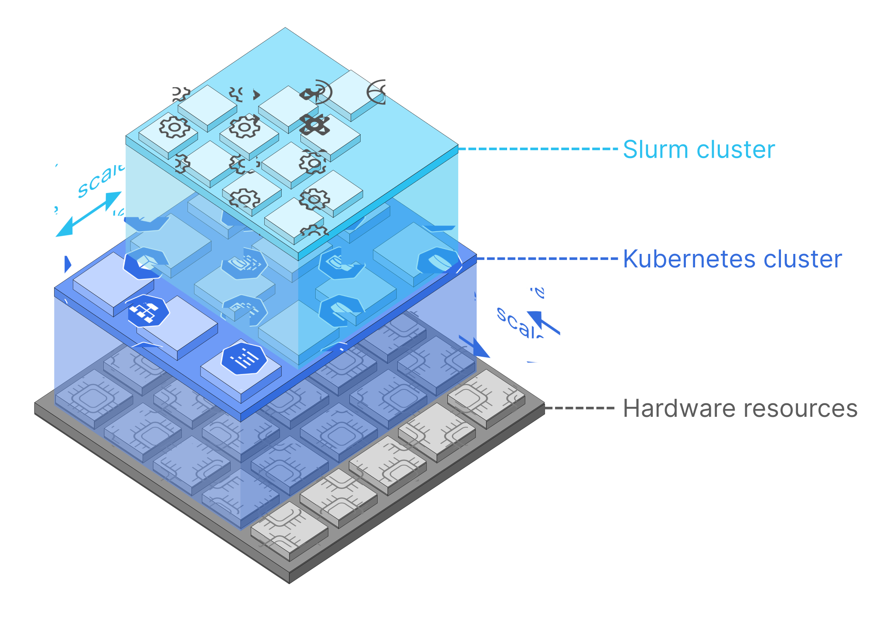

# Architecture

## Overview
Soperator can be installed to an existing Kubernetes cluster. It adds to it the ability to create new complex resources
of type `SlurmCluster`. The operator watches this resource's manifest and creates other K8s resources (usually usual 
ones such as `Pods`, `Services` or `StatefulSets`) to represent the Slurm cluster in K8s.

Here is the diagram showing how Soperator represents Slurm clusters via K8s resources:

This diagram is simplified and doesn't show all the resources involved, but this is enough to explain the concept as a
whole.

Soperator takes your desired Slurm cluster state (specified in YAML) and brings the Kubernetes resources in line. During
this process, it might bootstrap new Slurm nodes, change container images, update config files, mount new volumes, and 
so on.

The Slurm clusters it creates have three types of nodes: Login, Controller, and Worker (a.k.a. Compute), all represented 
as Kubernetes Pods (grouped into StatefulSets).

Login nodes can be exposed differently to users. The default option is to balance load - each time a user connects to 
the cluster via SSH, they're directed to a random node.

Various Slurm and system configs that Soperator controls are represented via ConfigMaps. Secrets are used as well for
storing Munge and SSH server keys.

While all containers have ephemeral filesystems (changes are lost after node restarts), we use Kubernetes Persistent 
Volumes to keep data around.

The real magic of Soperator lies in how we use the “jail” Persistent Volume. This shared filesystem is mounted on all 
Worker and Login nodes and contains another root directory, possibly of a different Linux distribution.

When users interact with the Slurm cluster (like browsing the filesystem in an SSH session or running a Slurm job), they
actually see this shared filesystem as their root “/” directory. This trick not only gives users a familiar Slurm 
experience but also actively makes their lives easier: they no longer have to keep filesystems identical across all 
nodes. They can install new software packages, create Linux users, write job outputs or checkpoint their model on one 
node, and those changes automatically show up on all the other nodes.

Read [below](#shared-root-filesystem) to find out how the shared-root feature is actually implemented.

The process of changing controlled resources in response to changes in the manifest is called reconciliation.

The operator is essentially a one endless loop that checks if everything corresponds to the configured state and fixes 
found inconsistencies. However, the loop itself isn't written by us, Soperator only implements some functions which are 
called from this loop in react to specific events.

We use [Kubebuilder SDK](https://github.com/kubernetes-sigs/kubebuilder) that frees
developers from writing boilerplate code. Some functionality can be added using config files and special annotations
added in the comments in the code.

## Components
Soperator consists of the following components:
- **The operator binary**. The entrypoint is defined in [cmd/main.go](../cmd/main.go) and the most of the code is
located at [internal/](../internal) directory. You can find the top-level code that is executed during the 
reconciliation cycle in the [internal/controller/clustercontroller/reconcile.go
](../internal/controller/clustercontroller/reconcile.go) file. You can start exploring the code from this place.
- **slurm-operator Helm chart**. It allows you to deploy the operator binary to a K8s cluster. There should be only 1 
operator in one Kubernetes cluster.
- **slurm-cluster**. It allows you to create the custom resource representing a Slurm cluster. You can apply it many
times if you need more than one Slurm cluster. The Slurm cluster is actually configured by values in this chart.
- **slurm-operator-crds**. It deploys the schema of the `SlurmCluster` custom resource, it should always be applied when
you upgrade the version of Soperator in your cluster.
- **slurm-cluster-storage**. This chart is optional. It can be used to create a PVC with a shared storage if your K8s 
cluster does not have a CSI driver for it.
- **Container images**. The [images/](../images) directory contains Dockerfiles for all containers Soperator creates. 
These images are quite complicated. A significant part of this solution and features it provides is actually 
implemented there and not in the operator's code. If you want to customize these images for your needs it's strongly
recommended not to try to write them from scratch. Instead, *derive* your container images from these adding or changing
things you want.

All these components are built using [Makefile](../Makefile).

## Feature implementation details
Here is a detailed description of how some important features work under the hood.

### Shared root filesystem
This feature is the most interesting from the point of view of technical implementation since nothing like this is used 
in other solutions.

All Login and Worker nodes share the same root filesystem from the user’s perspective. Combined with K8s containers, 
this takes away the headache of keeping nodes in an identical state. We call the environment where users do their work 
the “jail”.

“Host” environments are separate for each Slurm node, but they’re just pod containers — if something goes wrong, you can
restart them and get back to square one.

For Linux gurus, this approach may sound a bit out there. Linux isn’t built to share its root filesystem. That’s true, 
which is why the filesystem isn’t entirely shared — some directories are local to each node. These include `/dev`, 
containing device drivers; `/tmp`, containing temporary files stored in RAM; `/proc`, containing information about 
running processes; `/run`, containing runtime variable data; and others. Some low-level libraries, device drivers, and 
system configs are also not shared, though they’re identical — propagated (bind-mounted) from each host’s environment.

Here’s a diagram that tries to explain this concept visually:

While this approach won’t work for sharing the rootfs of an arbitrary Linux system, it should cover what Slurm users 
typically need. They usually don’t create new daemons or install device drivers between job submissions. Our Kubernetes 
operator can explicitly support such operations, but what users need often is always available.

Another consideration is the performance of shared filesystems, which is significantly worse than that of local ones. 
This can be solved by storing sensitive data on non-shared (or even in-memory) local filesystems mounted to subpaths 
inside the jail’s root, leaving other data on shared storage. Soperator supports such setups.

It's worth mentioning that Soperator still allows running your jobs in containers. It supports NVIDIA’s Pyxis plugin for
this. In this case, the shared-root feature isn't really useful, but the mediocre performance of shared storages doesn't
interfere with it: container images are stored on the shared storage, and this is convenient, but container filesystems 
are stored on node-local volumes that work fast.

To move Slurm job processes from the host to the jail environment, we wrote a SPANK plugin that runs after forking the 
Slurm worker daemon `slurmd`, but before launching the job’s command. Our routine creates and enters new Linux namespaces,
then changes the root directory the job process sees (using the `pivot_root` system call). All existing container 
runtimes, such as Docker or containerd, use a similar, though more complex, isolation method.

This plugin is called "chroot" and it's code is located in file [../images/common/chroot-plugin/chroot.c
](../images/common/chroot-plugin/chroot.c). As you can see, it's pretty short and doesn't do anything supernatural.

This plugin isn’t bound to Soperator setup and could theoretically work in typical (non-Kubernetes) Slurm installations.

We use a different approach to change the root directory for user-established SSH sessions to Login nodes. We simply use
OpenSSH’s ChrootDirectory feature.

The jail storage is initially populated at the moment of creating the cluster. It's done by the K8s job "populate-jail"
that runs only once. It uses [images/populate_jail/](../images/populate_jail) container image. The content this job 
copies is the filesystem of another container image called [jail](../images/jail).

### GPU health checks
This feature is specific to computations that use NVIDIA GPUs. It addresses the fact that these devices aren’t the most 
reliable and tend to fail under constant load.

Soperator tackles this by running periodic GPU health checks. If any Slurm node fails the check, the operator “drains” 
it, effectively removing the node from the pool for new job scheduling.

In the future, we’re planning to integrate with Nebius Cloud to not only drain problematic Slurm nodes but replace them 
with fresh ones. We’ll also try to leave room for integration with other cloud providers and on-premise K8s clusters.

There are two kinds of health checks in our solution:
1. **Quick checks** that take up to 10 seconds and don’t interfere with user workloads when run in parallel. These are 
implemented as Slurm’s `HealthCheckProgram`. They make sure the system recognizes GPUs correctly and there are no 
critical software or hardware issues.
2. **Longer checks** that take several minutes and run as regular Slurm jobs. Currently, we only have one such check 
that runs NCCL benchmarks. These checks queue up with user jobs and don’t interfere with them.

Here’s a diagram explaining how longer checks work. It’s not 100% accurate (especially the bash scripts), but it shows 
the general idea.

Soperator creates a Kubernetes CronJob that launches benchmarks on each node on a set schedule.

The benchmark job consists of running the NCCL test `all_reduce_perf` and comparing the resulting bus bandwidth to a 
configured threshold. If the result doesn’t meet the mark, the job itself changes the state of the current node to 
`DRAINED`, excluding it from running further jobs.

### Easy scaling
ML product development often involves several stages, each needing different levels of computing power. Sometimes, you 
need heavy-duty training; other times, just small experiments. Keeping (and paying for) the maximum hardware you might 
ever need is expensive and wasteful.

This isn’t something we work on specifically — we got it for free just by hosing Slurm in Kubernetes. However, the 
shared-root feature makes scaling easier because users don't need to set up new node environments.

The following diagram illustrates this concept.

Slurm nodes (represented as pods) are grouped into StatefulSets. Soperator allows users to adjust their sizes through 
the Slurm cluster definition.

Users can change a value in the YAML manifest and watch their cluster grow or shrink.

### Accounting
Slurm accounting provides a lot of possibilities for managing multi-tenant clusters such as dividing users into groups
with different limits, priorities, and QoS settings. It also enables storing job execution history for a long time, 
including detailed information about actual resource consumption.

This feature requires a database to be deployed. Soperator supports 2 options for interacting with the database:
1. You can deploy your database or use some managed solution your cloud provides has. In this case, you only need to 
specify a connection string in the Slurm cluster manifest.
2. The operator can run the MariaDB database in the same Kubernetes cluster, but you need to install [mariadb-operator
](https://github.com/mariadb-operator/mariadb-operator) on your own.

### High availability
Kubernetes brings some HA features out of the box. If some Pod or container dies (e.g., the Slurm controller), 
Kubernetes recreates it.

Our operator takes this a step further, constantly working to keep the entire cluster in the desired state.

### Observability
Soperator integrates with a monitoring stack that can be installed separately. It collects various Slurm stats and
hardware utilization metrics. Users can view this information on the dashboards.

We are still working on small improvements in this feature. Detailed documentation will be available later.
