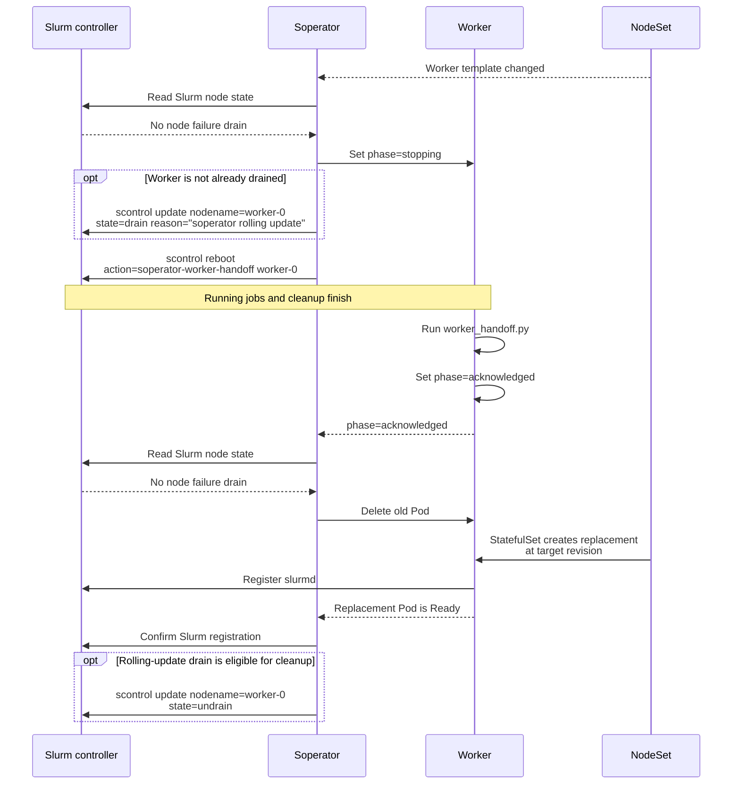
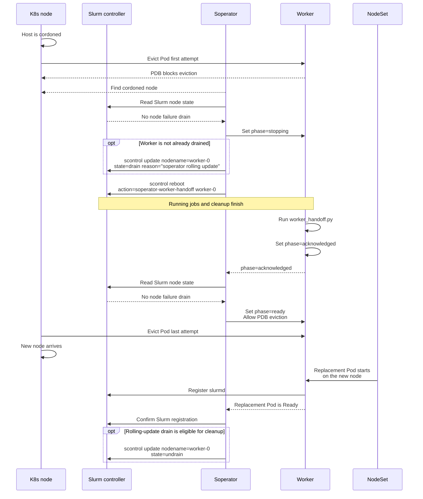
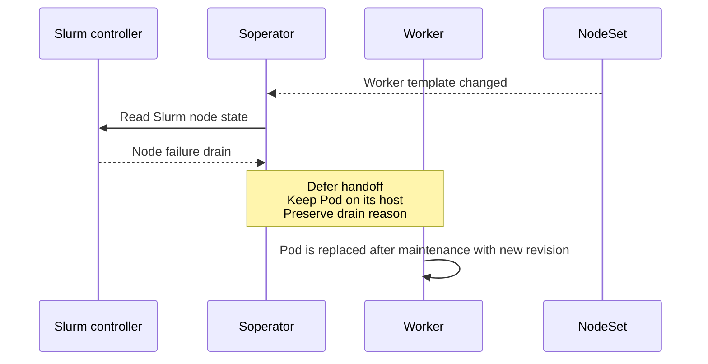
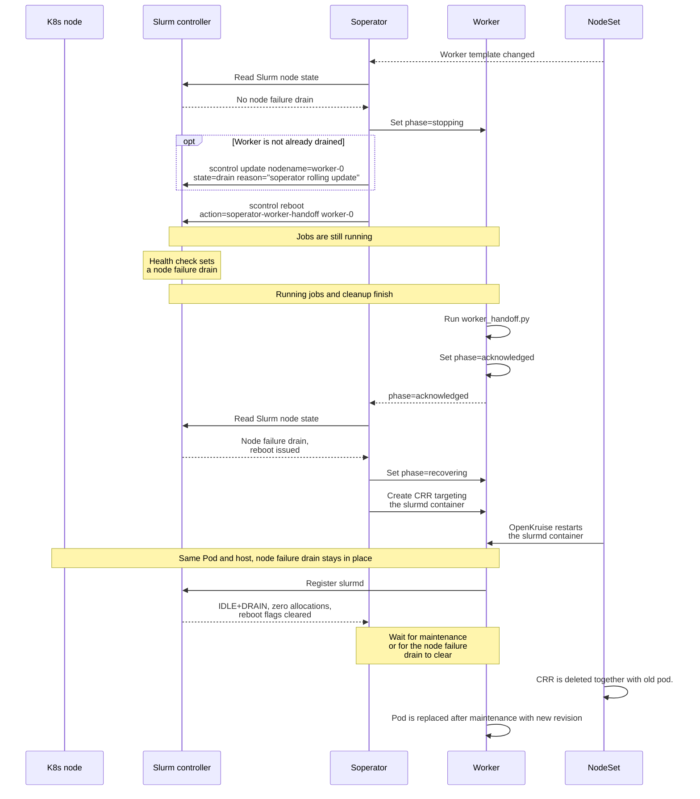

# Slurm-aware worker rolling updates

Soperator lets running jobs finish before updating workers or releasing them for Kubernetes node maintenance,
while preserving existing drain reasons.

## Configuration

Enable this behavior with `spec.updateStrategy: slurmAwareRollingUpdate` on a NodeSet and the `rollingupdate`
controller enabled. In the `nodesets` Helm chart:

```yaml
nodesets:
  - name: worker-gpu
    updateStrategy: slurmAwareRollingUpdate
    maxUnavailable: 1
```

| Setting | Description |
| --- | --- |
| `maxUnavailable` | Shared NodeSet budget for worker updates and node maintenance, including unavailable Pods and handoffs in progress. |
| `--requeue-after-rolling-update` | Delay after each reconciliation pass, including retries. Default: `1m`. |
| `--rolling-update-idle-slurm-audit-interval` | Interval between Slurm checks for idle NodeSets. Default: `15m`. |

Set the timing flags through `controllerManager.manager.args` in the `soperator` Helm chart.

## How a worker update works

The diagrams use shared components in a consistent order. `Worker` is the Pod running `slurmd`.
The `NodeSet` lane groups StatefulSet and OpenKruise actions. The `K8s node` lane shows host state and node maintenance.
Arrows point to the affected resource; Pod changes use the Kubernetes API.

Slurm actions use the equivalent `scontrol` commands for `worker-0`; Soperator sends them through the Slurm API.

When the worker template changes, Soperator selects outdated workers within the NodeSet's `maxUnavailable` budget.
For a worker on an uncordoned Kubernetes node, with no node failure drain, the flow is:



The worker StatefulSet uses `OnDelete`, so Soperator controls when an outdated Pod is replaced. Slurm's `reboot`
request uses the `soperator-worker-handoff` power action: once jobs have finished, Slurm invokes the handoff script.
The script verifies the Pod and operation identity, updates Pod labels, and exits. The controller decides what
happens next.

Soperator creates drains with the reason `soperator rolling update`. If the worker is already drained, it keeps
that drain and reason. After replacement, Soperator clears only its own rolling-update drains, once the Pod is
Ready and Slurm registration is complete. For example, a worker manually drained for `test` remains drained for
that reason after its update.

A health failure or Kubernetes node cordon can change the next step after acknowledgement, as described below.

## Kubernetes node replacement

A node replacement tool starts by cordoning a Kubernetes node and requesting eviction of its Pods. Soperator's
PodDisruptionBudget (PDB) protects workers until their Slurm handoff completes. This applies even when their worker
template is already up to date.



The PDB uses `maxUnavailable: 0` and excludes Pods with
`slurm.nebius.ai/worker-operation-phase: ready`. This `ready` label means the old Pod can be evicted;
the replacement's Kubernetes `Ready` condition means it has started successfully.

Soperator checks Slurm health before starting a handoff or releasing an acknowledged worker for eviction.
A node failure drain takes priority even on a cordoned host: the rolling-update controller waits for maintenance
or for that drain to clear. It restores PDB protection if the Pod was already released. If the handoff has already
reached `reboot issued`, Soperator recovers `slurmd` with the drain preserved, as described below.

## A worker has a node failure drain before its update starts

When a worker has a node failure drain, Soperator leaves the Pod on its current host. 
This keeps the health failure associated with the host that needs maintenance.



The recognized node failure reasons are `Kill task failed`, `[compute_maintenance] node replacement process`,
`[compute_maintenance] node reboot process`, `[node_problem]`, and `[hardware_problem]`. Reason matching uses the
same precedence as the maintenance controller. A `[user_problem]` drain, a `[software_problem]` drain (for example
broken NVIDIA driver libraries in the jail) or a manual drain can remain in place while the worker is updated.

The maintenance controller owns node replacement or reboot. Other workers can continue updating within the
available budget while this worker waits.

## A health failure appears while jobs are finishing

A worker can become unhealthy after Soperator has requested its reboot handoff. For example, a long-running job
is still using the worker when a health check changes its drain reason to `[hardware_problem]`.

Soperator keeps the Pod on that host and restarts its `slurmd` container through an OpenKruise `ContainerRecreateRequest` (CRR).



The worker stays drained throughout recovery, so new jobs cannot be scheduled on it. Soperator waits for the CRR
to succeed, the container identity to change, and Slurm to report an idle worker with zero allocations and cleared
reboot flags.
After recovery, the rolling-update controller waits for maintenance or for the node failure drain to clear,
even on a cordoned host.

## Metrics and dashboard

The [Soperator / Rollouts dashboard](../helm/soperator-monitoring-dashboards/dashboards/operator_rollouts.json)
shows worker counts by stage, rollout progress, and the main reason a NodeSet is waiting. Filter it by namespace,
SlurmCluster, and NodeSet. Metrics reflect the controller's latest observation.

| Metric | What it shows |
| --- | --- |
| `soperator_rollout_active` | Whether revision updates, readiness, handoffs, or Slurm cleanup remain incomplete. |
| `soperator_rollout_outdated_pods` | Workers that have not reached the target revision. |
| `soperator_rollout_available_handoff_slots` | Remaining budget for starting handoffs. |
| `soperator_rollout_last_progress_timestamp_seconds` | When an active rollout started or last made observed progress. |
| `soperator_rollout_workers{stage}` | Worker counts by stage, such as `waiting_for_jobs`, `waiting_for_eviction`, or `starting_pod`. |
| `soperator_rollout_waiting{reason}` | The dominant wait reason, such as `budget_exhausted` or `eviction_pending`. |

Workers with node failure drains awaiting maintenance or recovery appear in the `waiting_for_node_replacement` stage,
with `node_replacement_pending` as the wait reason unless a higher-priority blocker takes precedence. Failed
recovery appears as `blocked`.

The operator chart provides metrics scraping configuration when `serviceMonitor.enabled` is set.

### Metric labels

All rollout metrics use these controller and resource labels:

| Label | Meaning |
| --- | --- |
| `controller` | Fixed value `rollingupdate`. |
| `resource_namespace` | Namespace of the worker StatefulSet, which can differ from the operator's namespace. |
| `slurm_cluster` | SlurmCluster name. |
| `nodeset` | NodeSet name; falls back to the StatefulSet name if NodeSet identity is unavailable. |

`soperator_rollout_workers` also has a `stage` label, and `soperator_rollout_waiting` has a `reason` label,
with the values listed below.

### Worker stages

`soperator_rollout_workers{stage}` counts workers in each stage. Each observed Pod is counted once;
`waiting_for_pod` counts desired worker slots that have no Pod yet.

| `stage` | Meaning |
| --- | --- |
| `ready` | Pod is Ready at the target revision, with no pending handoff or rollout cleanup. Existing drains can remain. |
| `waiting_for_slot` | Replacement is waiting for space in the `maxUnavailable` budget. |
| `waiting_for_jobs` | Handoff is requested; Slurm reports allocated CPU or memory, or jobs in `COMPLETING`. |
| `waiting_for_slurm` | Handoff is requested with no observed allocations or completing jobs; Slurm has not issued the reboot yet. |
| `stopping_worker` | Slurm has issued the reboot; the worker's handoff acknowledgement is pending. |
| `waiting_for_eviction` | A cordoned worker has completed handoff and is waiting for the maintenance tool to evict its Pod. |
| `waiting_for_node_replacement` | Worker is waiting for node maintenance or recovery, including slurmd recovery in the existing Pod. |
| `deleting_pod` | Pod deletion was accepted or the Pod is terminating. |
| `starting_pod` | A Pod at the target revision exists but is not Ready yet. |
| `waiting_for_pod` | A desired worker slot has no Pod yet. |
| `restoring_slurm` | Rollout-related drain, reboot state, or Slurm registration needs cleanup or confirmation. |
| `missing_slurm_node` | A successful Slurm node listing did not contain the worker. |
| `blocked` | Replacement is not yet safe, or an action for this worker failed. |
| `unknown` | Worker state could not be confirmed, for example after an API failure. |

### Controller wait reasons

`soperator_rollout_waiting{reason}` is `1` for the dominant wait reason and `0` for the others. All reasons are `0`
when the rollout is confirmed complete. Errors and unsafe states take precedence over ordinary waits.

| `reason` | Meaning |
| --- | --- |
| `budget_exhausted` | No budget remains to start another handoff. |
| `reboot_pending` | The requested Slurm reboot is pending execution. |
| `handoff_pending` | Slurm has issued the reboot; the worker's handoff acknowledgement is pending. |
| `pods_not_ready` | The desired Pod revision or readiness has not yet been confirmed. |
| `eviction_pending` | A cordoned worker has completed handoff and is waiting for external eviction. |
| `node_replacement_pending` | A node failure drain delays replacement, or slurmd is recovering in the existing Pod. |
| `cleanup_pending` | Rollout-related Slurm state or worker registration needs confirmation, including removal of the rolling-update drain. |
| `safety_pending` | Observed Slurm state or allocations do not yet allow safe replacement of an offline worker. |
| `slurm_node_missing` | A worker needed for replacement is absent from a successful Slurm node listing. |
| `slurm_unavailable` | The Slurm client is unavailable, or a Slurm read or action failed. |
| `reconcile_error` | A Kubernetes operation or another reconciliation step failed. |
